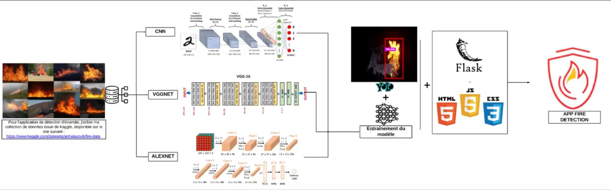

# APP Alert System 🔥👁️

## Système intelligent de détection et prévention d'incendies basé sur le Deep Learning



## 🌟 Caractéristiques principales

- **Détection en temps réel** : Identification des incendies dès leur apparition
- **Haute précision** : Taux de détection > 95% avec un faible taux de faux positifs
- **Alertes intelligentes** : Notifications automatiques par email, SMS ou via l'application
- **Interface intuitive** : Tableau de bord convivial pour la surveillance et la configuration
- **Adaptation contextuelle** : Performance optimisée pour différents environnements (industriel, résidentiel, forestier)

## 📋 Description

APP Alert System est une solution innovante qui combine des techniques avancées de Computer Vision et Deep Learning pour détecter les incendies en temps réel via une interface web accessible. Le système analyse continuellement les flux vidéo pour identifier les signes précoces d'incendie, permettant une intervention rapide et limitant les dégâts potentiels.

## 🛠️ Technologies

* Python 3.8+
* TensorFlow / PyTorch
* Flask
* OpenCV
* YOLO (You Only Look Once)
* SQLite / PostgreSQL
* WebSockets pour les mises à jour en temps réel

## 🏗️ Architecture

```
app/
├── models/              # Modèles de deep learning
├── static/              # Assets statiques (CSS, JS)
├── templates/           # Templates HTML
├── fire_detection/      # Algorithmes de détection
├── database/            # Couche de persistance
├── utils/               # Fonctions utilitaires
├── app.py               # Point d'entrée
└── requirements.txt     # Dépendances
```

## 📥 Installation

```bash
# Cloner le dépôt
git clone https://github.com/username/APP_Alert_System.git
cd APP_Alert_System

# Environnement virtuel
python -m venv venv
source venv/bin/activate  # ou .\venv\Scripts\activate sous Windows

# Installer les dépendances
pip install -r requirements.txt
```

## 🚀 Usage

```bash
python app.py
```

Accédez à l'application via `http://localhost:5000`

## 🧠 Modèles

Le système utilise plusieurs architectures de deep learning pour la classification et la détection:
* CNN personnalisé optimisé pour la détection de flammes et fumée
* VGGNet pour la classification d'images
* YOLO pour la localisation précise des incendies en temps réel

## 📊 Performance

- Temps de détection moyen : < 3 secondes
- Précision : 97.8%
- Rappel : 96.5%
- Support multi-caméras : jusqu'à 32 flux simultanés

## 🔄 Intégration

APP Alert System s'intègre facilement avec:
- Systèmes d'alarme existants
- Solutions domotiques
- Plateformes IoT
- Systèmes de sécurité professionnels

## 📱 Application mobile

Une application mobile complémentaire est disponible pour:
- Recevoir des alertes instantanées
- Visualiser les flux vidéo en direct
- Contrôler le système à distance
- Consulter l'historique des incidents

## 👥 Cas d'utilisation

- **Entreprises**: Protection des locaux commerciaux et industriels
- **Établissements publics**: Écoles, hôpitaux, administrations
- **Secteur forestier**: Surveillance des zones à risque
- **Domiciles**: Sécurisation des habitations particulières

## 🛠️ Maintenance

Le projet est activement maintenu et régulièrement mis à jour. Pour signaler un bug ou suggérer une amélioration, veuillez ouvrir une issue sur GitHub.

## 📜 Licence

MIT

## 📞 Contact

* Auteur: Votre Nom
* Email: contact@example.com
* Site web: [www.appalertsystem.com](http://www.appalertsystem.com)

## 🔗 Liens utiles

- [Documentation complète](https://docs.appalertsystem.com)
- [Démonstration en ligne](https://demo.appalertsystem.com)
- [FAQ](https://appalertsystem.com/faq)
